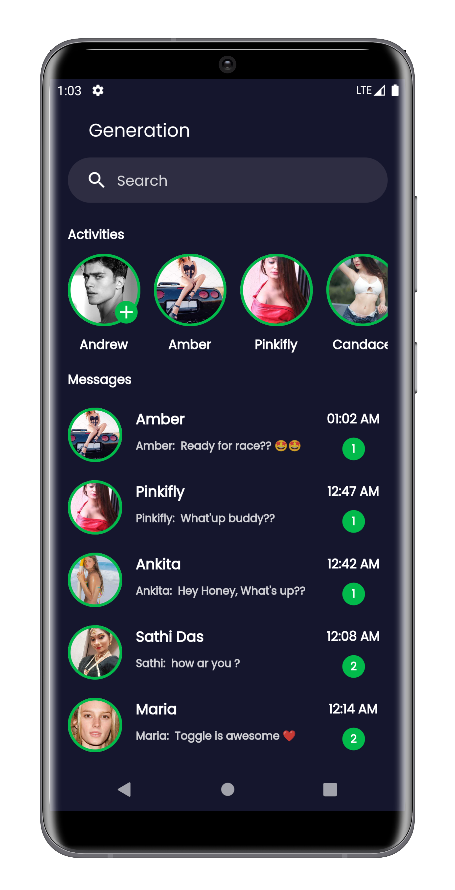
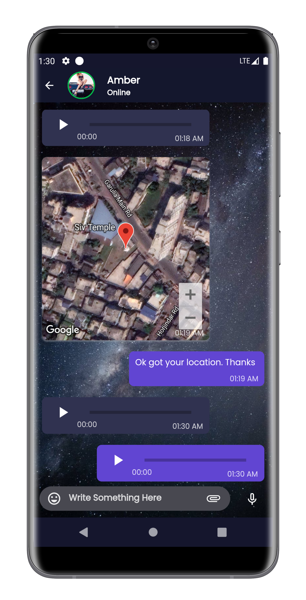

-Flutter-gold.svg)

# 
💙 Generation 💙

#### 
 ✨ A Private, Secure, End-to-End Encrypted Messaging app made in Flutter that helps you to connect with your connections without any Ads, promotion. No other third-party person, organization, or even Generation Team can't read your messages. ✨ 

#### 
 💖 Your Privacy our biggest priority. 💖

### 
 Generation App Sample Looks 

### 🎯 Authentication Types:-
| Email and Password Authentication 	| Google Authentication 	|
|:-:	|-	|

 

### 🎯 Special Features:-
#### 1. Chat Message Conversation

|               	| Chat Types|            	|            	|
|---------------	|--------------------------	|------------	|------------	|
|   Text Chat   	| Voice Chat               	| Image Chat 	| Video Chat 	|
| Document Chat 	| Location Chat            	| Audio Chat 	|            	|

#### 2. Activity Section
|               	| Activity Types 	|                  	|
|---------------	|----------------	|------------------	|
| Text Activity 	| Image Activity 	| Polling Activity 	|

#### 3. Connection Request Accept And New Connection Request Feature
#### 4. Multiple Connection Message Send Simultaneously

|  	|      Types   	|  	|
|-	|-	|-	|
| Text Chat 	| Image Chat 	| Voice Chat 	|
| Audio Chat 	| Location Chat 	| Document Chat 	|
| Video Chat 	|  	|  	|

#### 5. Media Visibility Section
|  	|  Media Visibility  	|  	|  	|
|-	|-	|-	|-	|
| Image 	|        Video 	|    Document 	|        Audio        	|
#### 6. Notification Settings Available for Global and Manual Chat

|  	| Notification Types 	|  	|  	|
|-	|-	|-	|-	|
| Background Notification Annotation 	| Online Notification 	| Remove Birth Notification 	| Remove Anonymous Notification 	|

#### 7. Chat Wallpaper

| Global Chat Wallpaper 	| Manual Chat Wallpaper 	|
|:-:	|-	|

#### 8. Support Section

| Report a Problem 	| Request a Feature 	| Send Feedback 	| Donate(Payment Gateway Integrated) 	|
|:-:	|-	|-	|-	|

#### 9.  Internal Search Section
#### 10. Audio Calling and Calling History Section(Beta)
#### 11. Profile Image Feature
#### 12. Chat Message Forward Feature
#### 13. Share Chat Contents via multiple apps
#### 14. Delete for Me for any chat messages

 

### 👀 Main APIs Used
| Firebase API 	| Google Map API 	|
|:-:	|-	|  

 

### 🎯 Plugins Used
#### 👉 Please see in [`pubspec.yaml`](https://github.com/SamarpanCoder2002/Generation/blob/main/pubspec.yaml) file

 

### 🎯 Important Points Needs to Know

#### 💥 Some Feature of this app written in Native part(Kotlin)
#### 💥 Screenshot and Screen Recording is restricted for this app due to Security
#### 💥 Except Audio Calling, all Messages and Activity are End-to-End-Encrypted
#### 💥 Activity(Status) will deleted automatically after 24 hrs after it's launch
#### 💥 API keys along with google-services.json file and Secure Keys removed for unwanted or unauthorized uses

 

### 🙋 For Any Enquery related to this project, Please Raise an issue in that Repo.

***

<h3 align="center">Show 💘 by Starring This Repo</h3>

- #### [Click Here to See the Project Video](https://youtu.be/QEDhmxzEqUA)

- #### [LinkedIN Video](https://www.linkedin.com/posts/samarpan-dasgupta-4aa1061b0_connections-introducing-project-activity-6811146891833704448-FyrC)

- #### [APK File Download Link](https://drive.google.com/file/d/1g1vvN6_rD99_N0wLhHjG06SDqi0r4LTx/view?usp=sharing)

<h3 align="center"><b>🧡 Thank You For Visiting 🙏, Have a Nice Day 🧡</b></h3>