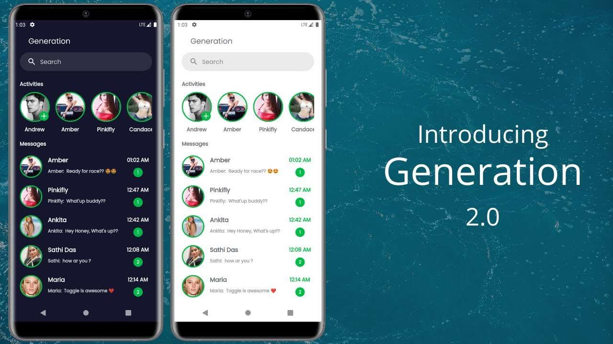
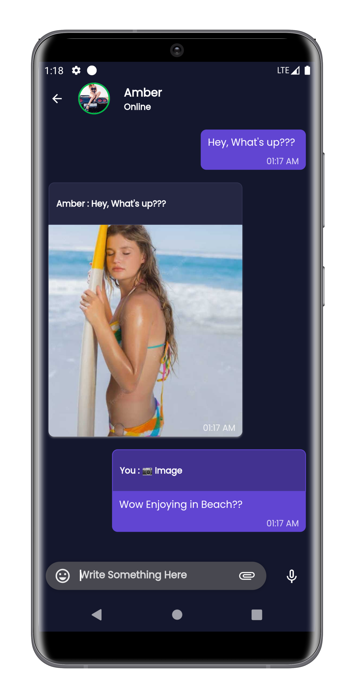

-Flutter-gold.svg)

 

# 
 Generation 2.0 

#### 
 ✨ A Private, Secure, End-to-End Encrypted Messaging app made in Flutter that helps you to connect with your connections without any Ads, promotion. No other third-party person, organization, or even Generation Team can't read your messages. ✨ 

#### 
 💖 Your Privacy is the biggest priority. 💖

### 
  

### 
 [Click here to know more about this app](https://generation.samarpandasgupta.com/)

### 
 Generation App Sample Looks 

  
#### ✨ Please Read [CONTRIBUTION.md](https://github.com/SamarpanCoder2002/Generation/blob/main/CONTRIBUTING.md) file before setup project in your machine before contributing in that repo.
  

### 🎯 Authentication Types:-
| Email and Password Authentication 	| Google Authentication 	|
|:-:	|-	|

 

### 🎯 Special Features:-
#### 1. Send Chat Messages With Following Types

| Text  | Image    | Video    |
|-------|----------|----------|
| Voice | Audio    | Document |
|       | Location |          |

#### 2. Make Activity of Following Types
| Text | Image | Video | Audio |
|------|-------|-------|-------|

#### 3. Media Visibility Section
| Image | Video | Audio | Document |
|-------|-------|-------|----------|

#### 4. Notification Settings Available for All or Particular Chat Connection

| Online Notification | Receive Notification when app is killed or in background |
|---------------------|----------------------------------------------------------|

#### 5. Chat Wallpaper

| Chat Wallpaper for All Connections | Personalized Chat Wallpaper for a Particular Connection |
|------------------------------------|---------------------------------------------------------|

#### 6. Support Section

| Report a Problem | Donation For Generation Improvement |
|------------------|-------------------------------------|

#### 7. Receive Notification When you send a connection request or Receive a connection request

#### 8. By Default Online and Background Notification When Message Receive is activated overall the app.

#### 9.  Search through your connections, available users, incoming and sent connection requests.
#### 10. Reply to any Activity
#### 11. Profile Customization Feature including Profile Picture, Name and About
#### 12. Messages Forward to Other Connections
#### 13. Share Chat Contents via multiple apps
#### 14. Delete for Me and Delete For Everyone for Any Chat Messages
#### 15. Instant Activate System, Dark and Light Mode Across the app.
#### 16. Extract Chat History for Any Connection.
#### 17. Reply to any Chat Message.
#### 18. Can Visit Latest Chat Message for any connection.
#### 19. Can see if any connection is Online or not. If not online, last seen will show there.

 

### 👀 Main APIs Used
| Firebase | Google Map | Cloud Messaging |
|----------|------------|-----------------|

 

### 🎯 Plugins Used
#### 👉 Please see in [`pubspec.yaml`](https://github.com/SamarpanCoder2002/Generation/blob/main/pubspec.yaml) file

 

### 🎯 Important Points Needs to Know

#### 💥 Some Feature of this app written in Native part(Kotlin)
#### 💥 All Messages and Activity are End-to-End-Encrypted
#### 💥 Activity(Status) will deleted automatically after 24 hrs after it's launch
#### 💥 API keys along with google-services.json file and Secure Keys removed for unwanted or unauthorized uses

 

### 🙋 For Any query related to this project(Generation), Please Raise an issue in that Repo.
 

<h3 align="center">Show 💘 by Starring This Repo</h3>

- #### [Click Here to See the Project Video](https://youtu.be/4MvZaJJ-qeE)

<h3 align="center"><b>🧡 Thank You For Visiting 🙏, Have a Nice Day 🧡</b></h3>
